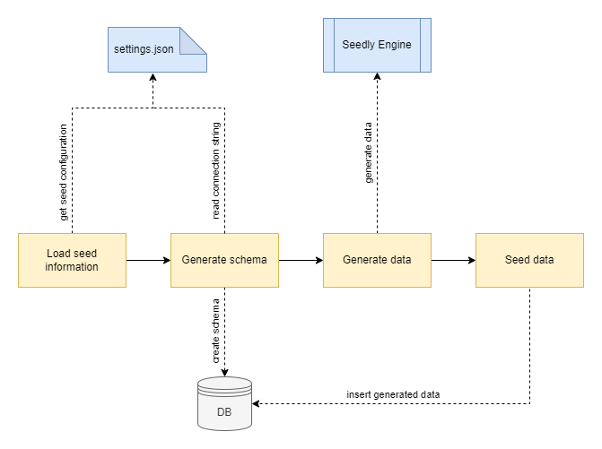

# About
Simple tool for creating database schema with a huge amount of data. Purpose of create Seedly is have a small tool which in very easy way simple strucutre of database for test algorithms like sorting, searching, etc. but on a really huge database.

# Key features
* Easy to setup
* Easy to run
* A lot of schema templates
* Support for the most popular database engines
* Forever for free!

# Concept

# Supported database
* Microsoft SQL
* PostgreSQL
* SQLite 3